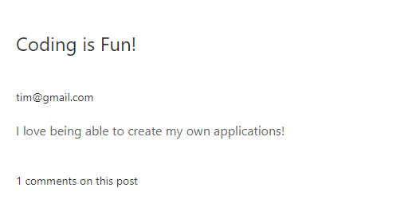

# Tech Blog!

## Description

This is an application that allows users to create their own profiles, post their own blog posts to a 
common message board, navigate to other user's posts and interact with them. Users can also edit and delete 
their posts if they choose to.

### Technology Used

Node.js, Javascript, MySQL, Sequelize, Handlebars, Authentication&Helpers, UIKit

### Visuals

### Links
Github Repository: https://github.com/will98nicholson/TechBlog
Heroku App: 